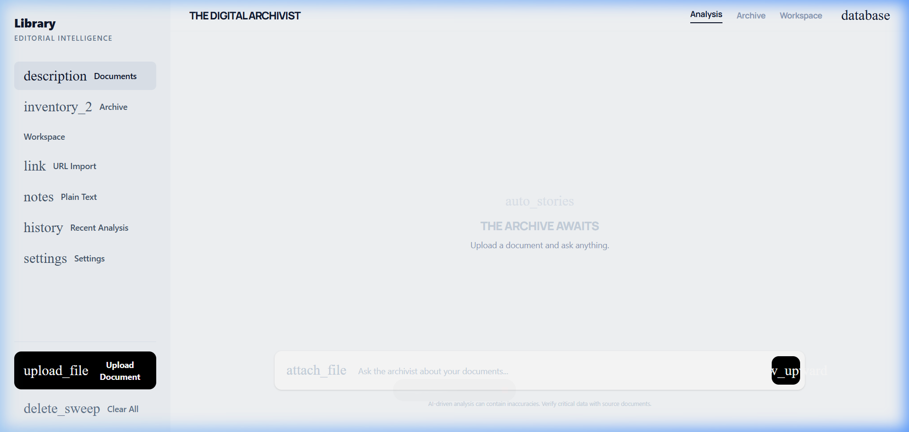
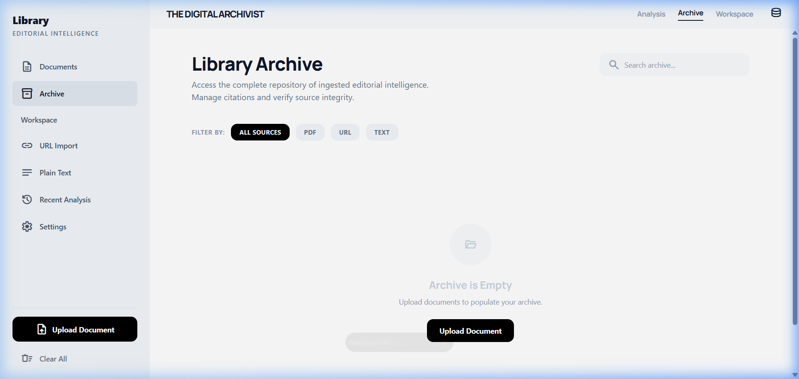
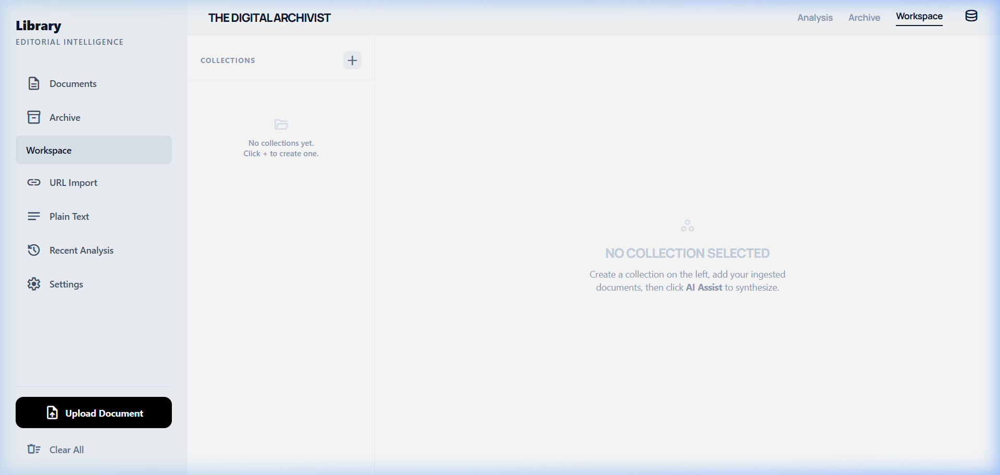

# 📚 RAG Q&A — Editorial Intelligence Platform

A full-stack **Retrieval-Augmented Generation (RAG)** application that lets you upload documents, ask questions grounded in their content, and synthesize multi-document insights — all running locally with no cloud API keys required.

---

## 📸 Screenshots

**Documents — Q&A Chat**


**Library Archive**


**Project Workspace**


---

## ✨ Features

| Feature | Description |
|---|---|
| **Document Q&A** | Ask natural language questions answered strictly from your uploaded documents |
| **PDF / URL / Plain Text ingestion** | Upload PDFs, scrape URLs, or paste raw text |
| **Cited answers** | Every answer includes inline `[filename]` citations and source excerpts |
| **Confidence scoring** | Each answer is rated by retrieval confidence |
| **Library Archive** | Browse, open, and delete all ingested sources |
| **Project Workspace** | Group documents into named collections and generate AI executive summaries |
| **Recent Analysis** | Full chat history that persists across page reloads |
| **Local-first** | Runs entirely on your machine via [Ollama](https://ollama.com) — no API keys |

---

## 🛠 Tech Stack

| Layer | Technology |
|---|---|
| Frontend | React + TypeScript + Vite + Tailwind CSS |
| Backend | FastAPI (Python) |
| LLM | Ollama — `ministral-3:3b` (generation) + `nomic-embed-text` (embeddings) |
| Vector Store | Custom in-memory store with cosine similarity, persisted to JSON |

---

## 🚀 Getting Started

### Prerequisites

- Python 3.11+
- Node.js 18+
- [Ollama](https://ollama.com) installed and running

### 1. Pull the required models

```bash
ollama pull ministral-3:3b
ollama pull nomic-embed-text
```

### 2. Backend

```bash
cd backend
python -m venv .venv
.venv\Scripts\activate        # Windows
# source .venv/bin/activate   # macOS/Linux

pip install -r requirements.txt
uvicorn main:app --reload
```

Backend runs at `http://localhost:8000`

### 3. Frontend

```bash
cd frontend
npm install
npm run dev
```

Frontend runs at `http://localhost:5173`

---

## 📁 Project Structure

```
RAG QA/
├── backend/
│   ├── main.py                 # FastAPI routes
│   ├── workspace_store.py      # Collection persistence
│   ├── uploads/                # Saved PDFs (git-ignored)
│   ├── vector_store.json       # Embeddings store (git-ignored)
│   └── rag/
│       ├── ingestor.py         # PDF / URL / text parsing
│       ├── retriever.py        # Vector store + cosine search
│       └── generator.py        # LLM prompt + answer parsing
└── frontend/
    └── src/
        ├── App.tsx
        └── components/
            ├── Sidebar.tsx
            ├── TopBar.tsx
            ├── ChatWindow.tsx
            ├── Archive.tsx
            ├── Workspace.tsx
            ├── RecentAnalysis.tsx
            ├── UrlImport.tsx
            └── PlainText.tsx
```

---

## 📝 Usage

1. **Upload** a PDF using the sidebar button or Archive tab
2. **Ask** questions in the Documents tab — answers cite sources inline
3. **Archive** tab lets you open or delete any ingested source
4. **Workspace** tab — create a collection, add sources, click **AI Assist** to generate an executive summary
5. **Recent Analysis** keeps your full Q&A history between sessions

---

## ⚠️ Notes

- First embedding on a large PDF can be slow — Ollama runs locally
- `vector_store.json` and `workspace_store.json` are auto-created on first run
- Uploaded PDFs are stored in `backend/uploads/` (git-ignored)
